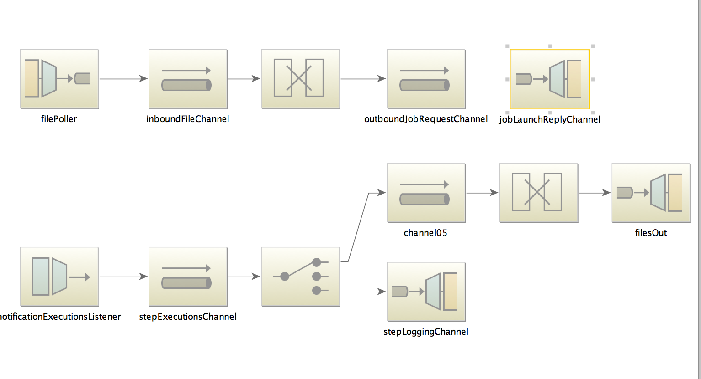

#Demo tamr Match Processing Application

##Overview
This application will read csv files from a preconfigured location. Each record within the 
csv file will be matched against Tamr.  

Any record that is found to be distinct will be added to Tamr.

Any record that is found to be a potential match will be compared to the record within Tamr.
If all fields match the record will be discared.  If any fields differ the record is added to 
the db for review.

##Execution
The application uses Spring Boot and will be delivered as a single executable jar.
Edit the application.properties to point to the correct settings and run it using the following command.

    java -jar matchdemo.jar

Configuration resources use the standard Spring Boot configuration loading order. 

See [Externalized Configuration](http://docs.spring.io/spring-boot/docs/current/reference/html/boot-features-external-config.html)

##Construction

A Spring Integration Flow is defined to poll the incoming  directory.  The incoming file
kicks off the following flow.

1. Transform the File into a new JobRequest
2. Execute the jobRequest
3. Job Request will be logged using a logging channel

A Step Execution Listener will start a second flow after each step

1. If the step is Completed
  * Transform the Step Completion into a File
  * Outbound channel moves the file to the completed directory
2. If the step is not completed.
  * Log the event.

The following diagram outlines the process.

